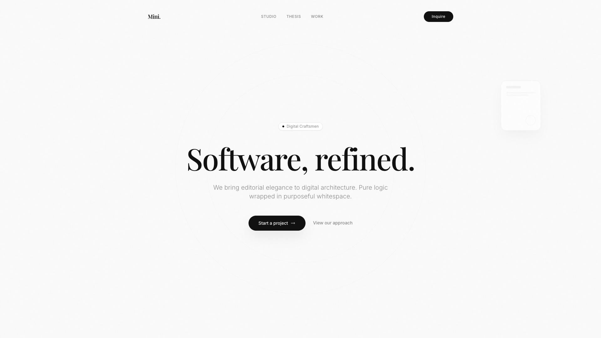

# Minimistic Landing Page

A highly-curated, minimalist editorial landing page crafted for modern digital architecture studios. 



## Overview
This project was constructed with an intentional focus on **Minimalist Aesthetics**, utilizing Stark Whites, Deep Charcoals, Playfair Display headers, and soft floating glassmorphism. It uses subtle GSAP micro-interactions and scroll pinning to emphasize narrative pacing over noise.

## Tech Stack
- **Framework:** React + Vite
- **Styling:** Tailwind CSS
- **Animation Engine:** GSAP (ScrollTrigger)
- **Icons:** Lucide React
- **Typography:** Playfair Display (Headers), Inter (Body)

## Getting Started

1. Clone the repository
2. Install dependencies:
```bash
npm install
```
3. Start the development server:
```bash
npm run dev
```

## Structure
- `src/components/Hero.jsx`: Intro view with scrolling typography.
- `src/components/Features.jsx`: Component showcase with tracking macro-interactions.
- `src/components/Philosophy.jsx`: Deep-contrast thesis statement.
- `src/components/Protocol.jsx`: Stacking horizontal scroll cards.
- `src/components/Membership.jsx`: Retainer pricing structures.
- `src/components/Footer.jsx`: End cap contact routing.
